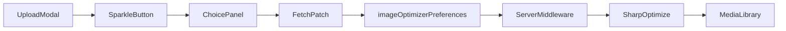

# Strapi Plugin Image Optimizer

Per-image optimization controls for the Strapi 5 Media Library upload flow.

[](https://www.npmjs.com/package/@frkntmbs/strapi-plugin-image-optimizer)
[](https://strapi.io)
[](https://nodejs.org)
[](LICENSE)

[GitHub](https://github.com/frkntmbs/strapi-plugin-image-optimizer) · [Issues](https://github.com/frkntmbs/strapi-plugin-image-optimizer/issues) · [npm](https://www.npmjs.com/package/@frkntmbs/strapi-plugin-image-optimizer)

---

## Overview

Strapi's Media Library uploads images as-is unless you add custom server logic. There is no built-in way to choose different optimization settings per file at upload time.

**Image Optimizer** adds a sparkle button to each pending upload card in the Media Library. Before you upload, you can choose to keep the file unchanged, apply your global profile, or configure format, quality, and dimensions for that specific image.

## Screenshots

### Media Library upload

Each pending asset shows the current optimization choice and a sparkle button to open per-file settings.


### Optimization choice

Pick **Keep original**, **Apply global settings**, or **Custom** for the selected image.


### Custom per-file settings

In **Custom** mode, configure format, quality, and output dimensions with aspect-ratio preservation.


### Global settings

Configure default upload choice and the global optimization profile under **Settings → Global → Image Optimizer**.


## Features

- **Three upload modes** — Keep original, Apply global settings, or Custom per file
- **Two optimization formats** — Convert to WebP, or Compress while keeping the original format
- **Per-format quality controls** — WebP quality, JPEG quality, and PNG compression level
- **Custom resize** — Set output width and height with automatic aspect-ratio preservation
- **Global settings page** — Configure defaults under **Settings → Global → Image Optimizer**
- **Admin i18n** — English and Turkish translations included
- **Role-based access** — Separate permissions for reading and updating global settings

## How it works



1. You pick optimization settings in the upload dialog.
2. Preferences are sent alongside the file in a dedicated `imageOptimizerPreferences` field (Strapi's `fileInfo` validation only allows a fixed set of keys).
3. Server middleware merges preferences into the upload pipeline before [Sharp](https://sharp.pixelplumbing.com/) processes the image.

## Requirements

- [Strapi](https://strapi.io) **5.x**
- Node.js **20–24**
- `@strapi/plugin-upload` (included with Strapi)

## Installation

```bash
npm install @frkntmbs/strapi-plugin-image-optimizer
```

Enable and configure the plugin in `config/plugins.ts`:

```ts
export default {
  'image-optimizer': {
    enabled: true,
    config: {
      defaultChoice: 'original',
      defaultMode: 'compress',
      webpQuality: 82,
      jpegQuality: 80,
      pngCompressionLevel: 9,
    },
  },
};
```

Rebuild the admin panel and restart Strapi:

```bash
npm run build
npm run develop
```

When installed from npm, no `resolve` path is required — Strapi loads the plugin from `node_modules` automatically.

## Configuration

All options can be set in `config/plugins.ts` (defaults) and overridden from the admin settings page (stored in the plugin store).

| Option | Type | Default | Description |
|--------|------|---------|-------------|
| `defaultChoice` | `'original'` \| `'global'` \| `'custom'` | `'original'` | Pre-selected option when opening the upload dialog for a new image |
| `defaultMode` | `'webp'` \| `'compress'` | `'compress'` | Optimization format used for global and custom profiles |
| `webpQuality` | `1–100` | `82` | WebP output quality |
| `jpegQuality` | `1–100` | `80` | JPEG output quality |
| `pngCompressionLevel` | `0–9` | `9` | PNG compression level (higher = smaller file, slower) |

### Optimization formats

| Mode | Behavior |
|------|----------|
| **WebP** (`webp`) | Converts the image to WebP. Typically yields the smallest file size. |
| **Compress** (`compress`) | Keeps the original format (JPEG, PNG, etc.) and reduces quality/compression. |

## Usage

### Upload flow

1. Open **Media Library** → **Add new assets**
2. Select one or more images
3. Hover a pending card and click the **sparkle** button (**Optimization settings**)
4. Choose a mode, adjust settings if needed, and click **Save**
5. Click **Upload** — each file uses the profile shown on its card

Global defaults can be changed anytime under **Settings → Global → Image Optimizer**.

### Upload modes

#### Keep original

No optimization is applied. The file is uploaded exactly as selected — same format, quality, and dimensions.

#### Apply global settings

Uses the global optimization profile from the settings page (format + quality). Resize is not applied in this mode.

#### Custom

Configure settings for a single image:

- **Optimization format** — WebP or Compress
- **Quality** — Fields shown based on the selected format and file extension (e.g. JPEG quality for `.jpg`, PNG compression for `.png`)
- **Output dimensions** — Defaults to the original size; change width or height to resize (the other dimension updates to preserve aspect ratio)

## Permissions

Global settings are protected by admin permissions:

| Action | Description |
|--------|-------------|
| `plugin::image-optimizer.settings.read` | View global Image Optimizer settings |
| `plugin::image-optimizer.settings.update` | Update global Image Optimizer settings |

Assign these in **Settings → Administration panel → Roles** for each admin role that should manage global defaults.

## Limitations

- **SVG and GIF** files are not processed — they upload unchanged regardless of the selected mode
- **Resize** is only available in **Custom** mode, not in Apply global settings
- Strapi uploads each pending card in a separate request; preferences are matched to the correct file by name and card order
- Optimization runs at upload time only — replacing an existing asset in the Media Library follows the same upload pipeline

## Compatibility

This plugin is designed for **Strapi 5**.

- Strapi **5.x**
- Node.js **20–24**
- `@strapi/plugin-upload` (included with Strapi)

## Security and privacy

This plugin does not send uploaded images to any external third-party service.
Image optimization is processed locally on your Strapi server using [Sharp](https://sharp.pixelplumbing.com/).
Uploaded files remain within the normal Strapi Media Library upload flow.

## Server resources

Large images can consume CPU and memory during optimization.
For small VPS environments, use reasonable resize and quality settings.
Avoid allowing extremely large image uploads unless your server resources are sufficient.

## Development

Clone the repository and install dependencies:

```bash
git clone https://github.com/frkntmbs/strapi-plugin-image-optimizer.git
cd strapi-plugin-image-optimizer
npm install
```

Build and verify the package:

```bash
npm run build
npm run verify
```

### Link to a Strapi project

```bash
npm run watch:link
```

In your Strapi app:

```bash
npx yalc add --link @frkntmbs/strapi-plugin-image-optimizer && npm install
npm run develop
```

## License

This plugin is licensed under the [MIT License](LICENSE).

This plugin uses [Sharp](https://sharp.pixelplumbing.com/) for image processing. Sharp is a separate open-source dependency and is licensed under its own license terms.

## Disclaimer

This is a community plugin and is not an official Strapi plugin.
Strapi is a trademark of Strapi Solutions SAS.

## Author

[frkntmbs](https://github.com/frkntmbs)
